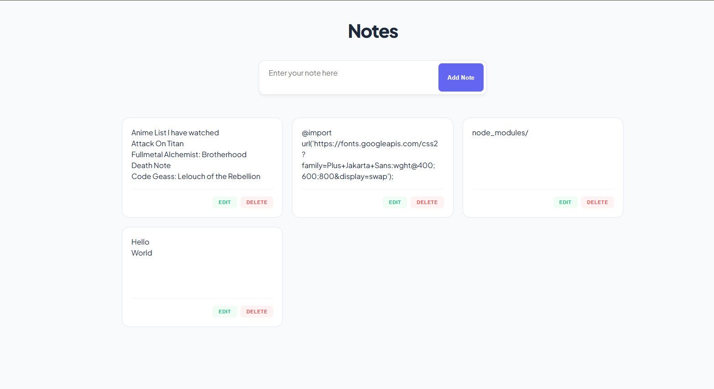

# Notes App

A simple Notes web app built using **Node.js, Express, and Vanilla JavaScript**.  
This project allows users to create, edit, and delete notes with a clean UI.

---

## Features

- Add new notes
- Edit existing notes
- Delete notes
- Real-time UI update
- Backend API using Express
- Data stored in JSON file (no database yet)

---

## Tech Stack

- Frontend: HTML, CSS, JavaScript
- Backend: Node.js, Express
- Storage: JSON file (fs module)

---

## Project Structure

```
project/
│
├── public/
│   ├── index.html
│   ├── script.js
│   └── style.css
│
├── routes/
│   └── notes.js
│
├── notes.json
├── server.js
└── README.md
```

---

## Installation

Clone the repository

```
git clone https://github.com/DAUD-01/Notes-App
```

Go to project folder

```
cd notes-app
```

Install dependencies

```
npm install
```

Start server

```
node server.js
```

Open in browser

```
http://localhost:3050
```

---

## API Routes

| Method | Route        | Description |
|--------|-------------|------------|
| GET    | /notes      | Get all notes |
| POST   | /notes      | Add note |
| PUT    | /notes/:id  | Update note |
| DELETE | /notes/:id  | Delete note |

---

## Future Improvements

- MongoDB database
- User authentication
- Better UI
- Deploy

---

## Picture


